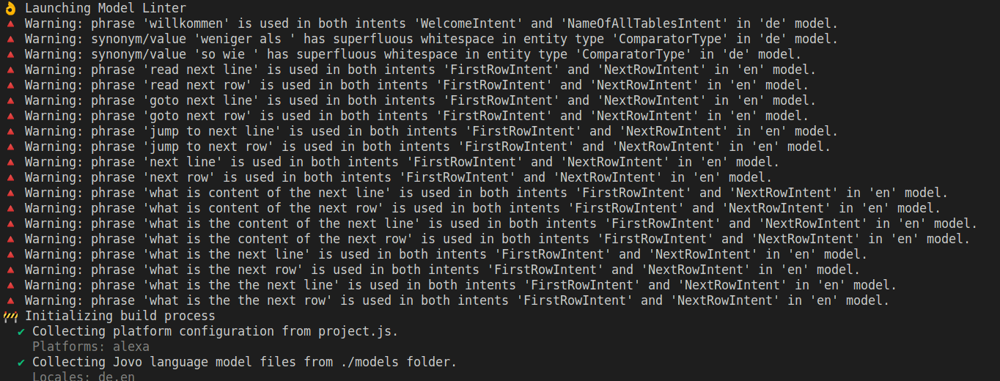

<a href= "https://prototypefund.de/project/voice-ql-datentabellen-mit-gesprochener-sprache-barrierefrei-erkunden/"></a>

# Model Linter Hook for Jovo V4

## Overview

This hook for the [Jovo V4 Framework](https://github.com/jovotech/jovo-framework) will auto check your model files against a number of rules when you run the build process.

## Voice model maintenance is hard

Maintaining voice model files is hard especially when they grow and get bigger. So easily you add duplicate contents without notice or use same utterances for different intents which may later lead to strange behaviour of your application at runtime.

## How can Model linter help?

The **Model Linter** will auto check your voice model files against a number of rules when you run the Jovo build process. While doing this the policy is to **never break a build** but to print *meaningful warnings* on the console in case something seems odd.

You may know why your are doing things as they are, so technically you can simply ignore the warnings. It is a good idea though to double check what **Model Linter** complaining about.

## How does Model Linter look like?

**Model Linter** hooks into the build process. It remains silent if there is nothing to say. In case some rule is violated the you will see a warning message on the console. The message is intended to support you with where the problem is and how to fix it.

An example may look as follows:



## Why should I use the Model Linter?

It costs nothing and may save you a lot of time! For sure you have better things to do.

## Is Model Linter complete?

**Definitely not**: up to now there are about ten different warning messages. Obviously you could do more.
But you have to start somewhere with a project and if you like **Model Linter** then tell me and I might add more rules to the list.

## Install

The hook can be installed as a package via **[npmjs](https://www.npmjs.com/)**. For more information see here:

[](https://nodei.co/npm/jovo-v4-community-hook-model-linter/)

From the console you may install the hook right into your Jovo project and save the dependency in your **package.json**:

`npm install jovo-v4-community-hook-model-linter --save`

Register the hook in:

jovo.project.js:

```javascript
const { ModelLinterHook } = require("jovo-v4-community-hook-model-linter");

const project = new ProjectConfig({
  hooks: {
    'before.build:platform': [ModelLinterHook],
  }, // [...]

```

jovo.project.ts:

```typescript
import { ModelLinterHook } from "jovo-v4-community-hook-model-linter";

const project = new ProjectConfig({
  hooks: {
    'before.build:platform': [ModelLinterHook],
  }, // [...]
```

## License

Apache V2

## Acknowledgements

The code published here is part of the project "[Voice QL](https://prototypefund.de/project/voice-ql-datentabellen-mit-gesprochener-sprache-barrierefrei-erkunden/)" which receives funding from the [German Federal Ministry of Education and Research](https://www.bmbf.de/) (FKZ 01IS22S30)

[](https://www.bmbf.de/)
&nbsp; &nbsp;
[](https://okfn.de)
&nbsp; &nbsp;
[](https://prototypefund.de/)

The Prototype Fund is a project of the Open Knowledge Foundation Germany, funded by the German Federal Ministry of Education and Research (BMBF).
